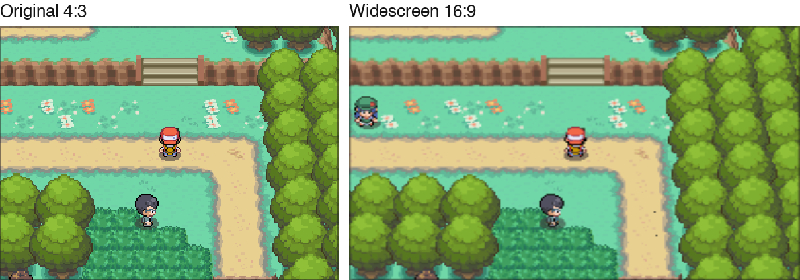
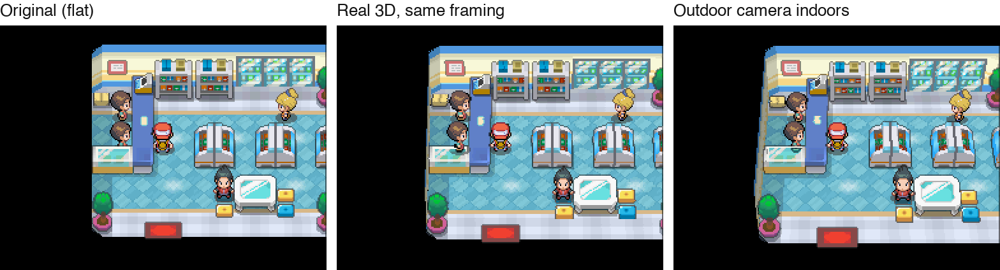
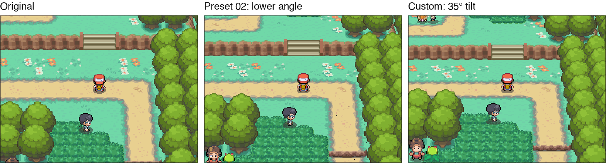

import { Aside } from '@astrojs/starlight/components';
import CameraCodes from '../../components/CameraCodes.astro';
import CameraPresets from '../../components/CameraPresets.astro';

These Action Replay codes change how the overworld looks: a 16:9 widescreen view, real 3D inside buildings,
a lower or steeper camera angle, or a camera you tune yourself. They are optional and change the view. Widescreen also adjusts the 3D player model in the Bag.
Forced camera presets can persist in your save until you change maps, as explained below.

<Aside type="caution" title="Origin HeartGold only">
These codes are made for Origin HeartGold v4.0.3 (the English patch from v1.0.0-rc5, and the original Chinese
game). Codes for HeartGold, SoulSilver or other hacks don't work here, and these codes don't work there.
</Aside>

## How to use the codes

1. Add a code in your emulator's cheat menu (melonDS and DeSmuME: **Action Replay** codes), or in your
   flashcart's or TWiLight Menu++'s cheat list.
2. Turn the code on. **The camera changes the next time you go through a door or load your save**, not instantly.
3. To go back to normal, turn the camera code off and go through a door. For widescreen, disable **ON**,
   enable **OFF**, set your emulator’s top screen back to **4:3**, then go through a door or reload your save.

You can combine widescreen with one camera code. Use only **one** camera code at a time.

## Widescreen (16:9)

Shows more of the world on the left and right. Set your emulator's top screen to 16:9 as well; otherwise the
picture looks squeezed.



**Widescreen ON**

```
52023640 00001555
02023640 00001C72
D2000000 00000000
```

**Widescreen OFF** (back to 4:3)

Disable the ON code first; never enable both together. Set your emulator’s top screen back to 4:3,
then go through a door or reload your save.

```
52023640 00001C72
02023640 00001555
D2000000 00000000
```

The code adjusts the 3D projection, including the overworld and the player model in the Bag.
2D graphics on the top screen are stretched by your emulator’s 16:9 display setting.

## Real 3D inside buildings

Houses, Pokémon Centers, Poké Marts and almost every other interior use a **flat camera**: the room is
drawn without perspective, so it looks 2D. Players have reported that some emulator renderers (a recent melonDS test build with Vulkan) draw these
rooms wrongly. These codes give interiors a real 3D camera. Routes, towns, caves and the
gyms with their own camera angle are not changed.



**Real 3D, same framing.** This looks almost like the original, with a little depth on walls and shelves:

```
521E9C54 B084B5F8
02205448 02810000
022055D4 02810000
D2000000 00000000
```

**Outdoor camera indoors.** Rooms are shown at the same angle and distance as routes and towns:

```
521E9C54 B084B5F8
0220543C 0029AEC1
02205440 0000DD62
02205448 05C10000
02205450 004B0000
022055C8 0029AEC1
022055CC 0000DD62
022055D4 05C10000
022055DC 004B0000
D2000000 00000000
```

## Use one camera angle everywhere

The game has 17 built-in camera presets. Most outdoor maps use preset `00`; a few gyms, towers and the Battle
Frontier have their own. This code makes every map use the preset you choose. Replace `XX` with a preset number
from the pictures below:

```
621CFF30 00000000
B21CFF30 00000000
20001308 000000XX
D2000000 00000000
```

**Outdoors** (Route 1):

<CameraPresets kind="outdoor" />

**Inside buildings** (a Poké Mart):

<CameraPresets kind="indoor" />

Good choices:

| Preset | What it looks like |
|---|---|
| `00` | the normal outdoor camera, in buildings too |
| `02` | a lower angle (40° instead of 49°) |
| `06` | slightly lower, sees a bit further |
| `09` | steeper, more top-down |
| `0A` | close-up with a wide lens |
| `03` | very low and cinematic; you see the edge of the loaded map |

`04` and `0F` are the flat interior cameras. Numbers above `10` don't exist: don't use them.

<Aside type="note" title="This code is stored in your save">
This code changes a value that is saved with your game. If you save with it on and later load without it, you
keep that camera until you go through the next door. Nothing else is affected.
</Aside>

## Build your own camera

Pick where the camera changes, start from a preset and move the sliders. Then copy the code into your cheat list.



<CameraCodes />

- **Tilt** is how far the camera looks down. The normal camera tilts 49°; lower values show more of what lies ahead.
- **Distance** zooms in or out. **Field of view** works like a camera lens: wider shows more, with stronger perspective.
- **Draw distance**: raise it when you lower the tilt or zoom out, or far-away ground gets cut off.
- The game only loads the area around you. Very low angles and big zoom-outs show the edge of the map, and
  people may appear late.

## Good to know

- These codes were tested in an emulator (DeSmuME) on the English patch. They use standard Action Replay code
  types, but they have not been tested in melonDS, on a DS or with TWiLight Menu++ yet. If you try them there,
  please [tell us how it went](../contribute/).
- The interior and preset codes change the overworld camera. Widescreen changes a shared 3D setting,
  including the Bag model. Tested wild battles and returns to the overworld worked with both code types;
  this is not an exhaustive test of every battle or animation.
- The first line of the building and custom codes (`521E9C54 B084B5F8`) is a safety check: it makes sure
  the code only writes while you are in the overworld. Keep it.
