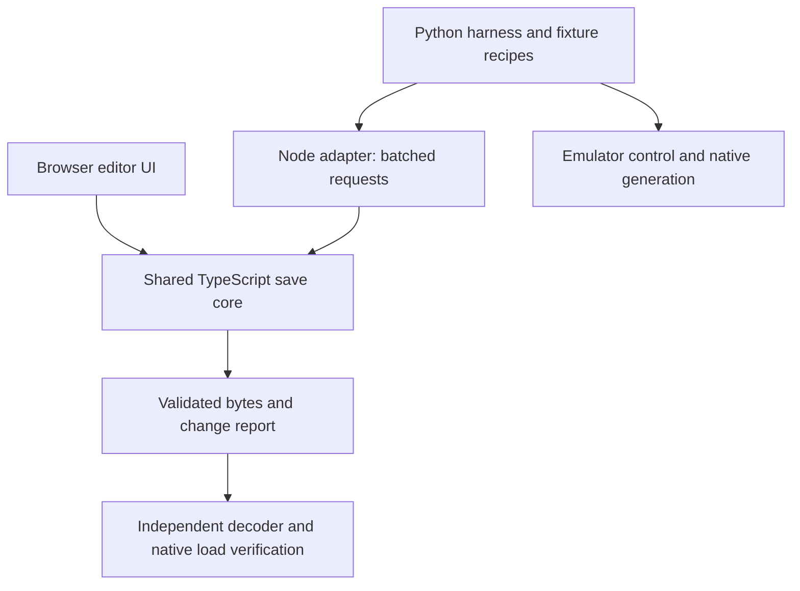

Repeatable current native gate: [commands, pinned inputs and limits](NATIVE_VERIFICATION.md).

# Save-core unification research

> Historical baseline research. The implementation and current verification are
> described in [IMPLEMENTATION.md](IMPLEMENTATION.md). `probe.py` characterizes
> the old `e084341` implementation and deliberately asserts its former unsafe
> behavior; it is not a regression gate for the new core.

Research date: 2026-10-09. Baseline: `e084341` (`develop`).
Branch: `research/save-core-unification`.

**Recommendation: extract the browser editor's binary code into a shared TypeScript
core, use it directly in the browser, and call the same compiled modules through a
small Node adapter from the Python harness. Strengthen its transaction and
validation boundaries before migrating callers.** Keep emulator orchestration in
Python and keep independent verification readers independent.

This work contains a runnable characterization probe and a migration proposal.
It does not change production code, build a ROM, create playable saves, install
dependencies, or change the original saves. Findings below distinguish observed
behavior from implementation proposals and unresolved native behavior.

## Existing implementations and migration surface

| Area | Browser editor | Python harness |
|---|---|---|
| Save block selection and CRC | `work/save-editor/src/save.ts` | `SaveFile`, `work/tools/emu_harness.py:227` |
| Container handling | `save-container.ts`: raw and DeSmuME footer | Raw 512 KiB only |
| Pokémon codec | `pokemon.ts`, immutable validated edits | `decode_pokemon`, `decode_party_pokemon`, `encode_pokemon` |
| Stats and traits | `stats.ts`, level/IV/EV/nature/shiny/Pokérus | Narrow base editor; several recipe-specific extensions |
| Inventory | `inventory.ts`: money, eight pockets, metadata validation, sorting, shortcut cleanup | `SaveFile.set_pocket`: direct pocket replacement |
| Location and progression | Outside UI scope | Locations, map objects, flags, variables |
| Fixture creation | No blank-save constructor | `start_at` clones and modifies a seed save; `generate_pokemon` drives the game's debug generator |
| Live memory | None | `Harness.edit_party_mon`, RAM setters and emulator callbacks |

The implementations share research, not executable code. Ordinary encryption is
compatible: the TypeScript logical-block offsets are the inverse representation
of Python's physical-block permutation. The probe confirms all 32 selector rows
and exact output parity for full four-slot move edits. Do not treat the differing
table representations as a bug.

Additional production codec users that a migration must address:

- `emu_open.py`: `_plain`, `with_exp`, `exp_of`; intentional experience-only edits
  leave cached level unchanged so native level-up behavior can be tested.
- `emu_calendar.py`: `full_mon`, `calc_stats`; currently diverges on nature overrides.
- `emu_guide0107.py`: `mon_details`, direct encrypted HP edits.
- `emu_guide0813.py`, `emu_fixes.py`: extra record decoding, including nicknames.
- `emu_hackbugs.py`: direct block edits for selected scenarios.
- `emu_hang.py`, `emu_sweeps.py`, `emu_reflection.py`, `emu_vqueue.py` and other
  recipes call the existing `SaveFile`/`Harness` mutation interfaces.

Independent evidence readers have a different role: `memcheck.py`,
`quality_runner.py`, and `work/save-editor/scripts/verify-runtime.py` validate
results or stored evidence. They should retain a small independent read-only
decoder or native-getter oracle. Reusing the production writer's decoder for
every verdict would remove a useful independent check.

## Reproduced weaknesses

Run `probe.py` to reproduce these without a ROM or an emulator. Synthetic saves
have valid general-block footers and invented data; they are not playable saves.

| Priority | Finding | Evidence and required change |
|---|---|---|
| High | Unbounded harness setters overwrite neighboring fields | `set_flag(-1)` changes `0x118B`; `set_flag(0xCC0)` changes `0x1324`, the start of LocalFieldData. `set_var(0x3FFF,1)` changes `0xEAA`, before the vars array; `set_var(0x4170,1)` changes `0x118C`, the start of flags. Validate region bounds, integer IDs and values before writing. |
| High | Party slot/count checks are missing | `edit_party_mon(6,...)` writes beyond the six slots, into the region that includes the bag. Raising a one-member party to six activates checksum-invalid unused records. Enforce active-slot bounds; separate shrinking from validated appending. |
| High | Corrupt Pokémon input can be silently legitimized | Harness decode reports a failed checksum, but `encode_pokemon` still edits it and emits a valid checksum. Require valid closed records for writes; put intentional corrupt-fixture construction in an explicit test-only path. |
| High | Failed bag edits mutate the working save | Replacing a valid pocket with `[(51,2),(52,-1)]` throws after clearing the old pocket and writing partial new data. Validate first and apply a whole transaction to a private copy. |
| Medium | Mirror policy differs | Python picks mirror `0x40000` for equal counters, including divergent data; TypeScript rejects divergent ties and permits only reading identical ties. Python picks the numerically higher counter at rollover; TypeScript rejects the ambiguity. Unify an explicit policy after native-loader verification. |
| Medium | Invalid party headers accepted in Python | Capacity 0 or count 7 is accepted by `SaveFile`; `party()` silently clamps counts to six. TypeScript rejects these headers. Make structural validation consistent. |
| Medium | Browser modules need a stronger public mutation boundary | `patchPartyRecord` accepts a zero-filled, invalid 136-byte record and repairs the outer save CRC; its comment delegates Pokémon validation to callers. That is an internal precondition today, but unsuitable as an unchecked public CLI operation. Validate replacement records at the public transaction boundary. |
| Medium | Node Buffer integration bug | `unwrapSave(Buffer)` aliases raw input because Buffer `.slice()` returns a view. Valid `.dsv` Buffers are rejected because `new DataView(footer.buffer)` ignores the footer's byte offset. Typed-array browser inputs work. Normalize with `Uint8Array.from`, and always construct DataViews with offset/length. |
| Medium | Nature interpretation has drifted | An independently constructed record with nature override 24 is decoded as 24 by the browser and 12 (`PID % 25`) by `emu_calendar.full_mon`. Shared effective-field accessors should replace this production helper. |

The flag boundary demonstration is a storage-overlap proof, not proof that every
lower flag ID is valid. The current adjacent array offsets bound the region;
actual flag count and any padding must be checked against the Chinese native
allocator/getters. The RAM harness's `flag < 0x4000` test also does not establish
that an ID fits the saved flags allocation.

There are intentional differences to preserve through explicit operations:

- `encode_pokemon(moves=[85])` replaces only slot 0, uses PP 10 by default, preserves
  its old PP Ups and keeps the remaining three moves. The browser API requires
  four complete slots. Provide distinct `patchMoveSlots` and `replaceMoveset`
  semantics; audit existing callers instead of silently padding every request.
- Species/form changes and `with_exp` can deliberately leave cached stats stale
  for a native recalculation test. A normal edit should recalculate all dependent
  fields using verified reference data. A harness-only operation must explicitly
  request preserving the tail and record that choice in its evidence.
- Open/decrypted RAM records are distinct from closed battery records. Inspection
  may need flag-aware diagnostic reads; production writes should reject open
  records and retry at a stable frame. The current Python party-tail decoder
  always XORs the tail, even when a runtime record may be open (static audit;
  not exercised by this probe).
- Bag fixtures sometimes need controlled ordering or unusual values to provoke
  behavior. Standard inventory edits should retain the browser's quantity,
  pocket, sorting and shortcut rules. Exceptional fixtures need named, bounded
  test operations rather than a global switch that disables all validation.

## Native save recovery is a prerequisite, not a settled specification

Neither implementation proves that its general-only selection policy always
matches the Chinese hack on torn/mixed saves. The editor's current comments
overstate that conclusion for unusual cases.

The upstream HeartGold implementation has a `0xFFFFFFFF`/0 counter special case,
chooses the first mirror on ties, and considers general/storage validity and
counter coherence together; some mixed-counter cases fall back to an older
coherent save. These are useful scenarios to investigate, not authority for
changing Origin behavior. See
[pret's save loader](https://github.com/pret/pokeheartgold/blob/master/src/save.c),
especially `SaveCounterCompare`, `SaveSlotCheckCompare`, and
`Save_GetSaveFilesStatus` (browsed 2026-10-09).

PKHeX selects general and storage buffers independently in
[SAV4](https://github.com/kwsch/PKHeX/blob/master/PKHeX.Core/Saves/SAV4.cs).
Its [HGSS layout](https://github.com/kwsch/PKHeX/blob/master/PKHeX.Core/Saves/SAV4HGSS.cs)
also has different block sizes from Origin. It is a comparison source, not a
drop-in implementation or proof of this hack's loader behavior. No upstream
source was copied or installed.

Before claiming native selection parity: derive the Chinese loader's branches
from the existing local ROM, then boot isolated copies with identifiable benign
markers in each mirror. Cover ordinary counters, damaged general/storage copies,
never-written backups, equal identical/divergent mirrors, crossed general/storage
counters, and rollover. Record the selected RAM data, save result and reset/reload
result. Preserve both ROM hashes and the seed-save hash. Tests must run against
the untouched Chinese reference as well as the English build.

Until proven, report `inspectable` separately from `safe to edit` and `native load
verified`. Reject ambiguous mutations without rewriting counters or mirroring
data to make the ambiguity disappear. A valid CRC does not prove playability.

## Recommended architecture



Proposed package layout, all under `work/`:

```text
save-core/
  src/layout.ts          Origin profile, field spans, provenance
  src/container.ts       Raw/DSV wrapping and byte ownership
  src/save.ts            Inspection, selection diagnostics, transactions
  src/pokemon.ts         Closed records, codec, typed field edits
  src/stats.ts           Native stat rules and dependent-field recalculation
  src/inventory.ts       Money, pockets and registered items
  src/fixture.ts         Bounded harness-only operations
  src/errors.ts          Machine-readable errors, no UI rendering
  src/reference.ts       Injected versioned numeric metadata interface
  cli/worker.mjs         Node-only input/output boundary
  tests/                 Independent synthetic fixtures and invariants
tools/save_core.py        Python compatibility facade and worker lifecycle
save-editor/src/          UI, drafts, file picker, labels and error presentation
```

Start by extracting the current modules, not rewriting their working algorithms.
Retain small re-exports temporarily to reduce editor churn. The shared core must
have no DOM, filesystem, emulator or Node-only imports. UI labels can be mapped
from stable pocket/error IDs. Reference providers should supply verified numeric
tables; keep the browser's bundled English names separate from language-neutral
codec behavior. CN/EN fixtures share a format only to the extent proved by the
profile's evidence; a save footer alone cannot identify a hack or language.

A mutation should accept original bytes plus a complete ordered operation list,
validate all operations, modify a private copy, update affected checksums once,
validate the output, and return bytes plus a change report. Include selected
mirror, profile/reference identity, semantic changes, permitted byte ranges and
source/output hashes. Exact no-ops must return byte-identical content. On failure,
return a structured error with operation index and leave both source and working
state unchanged. Checksum changes can alter the whole encrypted record, so byte
allowlists must allow its ciphertext while checking unchanged plaintext fields.

Use semantic APIs rather than exposing `patchGeneralRegion` through the public
protocol. Keep raw region access internal or in a clearly separate fixture API
with explicit spans, preconditions and an audit reason. Container footer, backup
mirror, PC storage, unknown fields, padding and existing counters stay byte-exact
unless a verified operation explicitly owns them.

Python `SaveFile` can keep familiar method names while recording operations;
`write()` sends one transaction. Replace direct mutable `.data`/`_a` access at
call sites rather than allowing it to bypass validation. Live-memory writes use
the same record operations on a captured closed record, check that the record
has not changed before applying it, and remain synchronized with emulator steps.

The Python adapter should start one worker per harness process, use versioned
request IDs and bounded JSON-line messages, reserve stdout for protocol data,
send diagnostics to stderr, and handle deadlines, crashes and clean shutdown.
Use argument arrays and `shell=False`; Python documents timeout and subprocess
lifecycle semantics in its
[subprocess reference](https://docs.python.org/3/library/subprocess.html).
Do not start Node once per field or perform blocking IPC inside instruction
hooks. Capture observations and decode them in batches outside callbacks.

The CLI should write a new destination by default. Validate completely before
writing, use a temporary file in the destination directory, flush and atomically
rename, and refuse accidental input/output aliasing or overwrite. This is separate
from the browser's download mechanism. Production transport must also cap input
size and validate JSON types; TypeScript annotations do not validate JSON.

### Options considered

| Option | Benefit | Cost / decision |
|---|---|---|
| TypeScript core + Node adapter | Reuses the stricter implementation and native stat research; browser remains a static client; one writer | Adds Node to harness prerequisites and requires process lifecycle handling. Recommended first implementation. |
| Rust core + WebAssembly + Python/native binding | One implementation with in-process use and strong typing | New build/distribution toolchains and a rewrite of validated behavior. Revisit only if measured callback/throughput constraints require it. |
| Shared schema with separate Python/TS codecs | Centralizes offsets, convenient native runtimes | Still duplicates mutation semantics, crypto and recovery policy; useful transitional contract, not full unification. |
| Python core in the browser | Keeps the current harness language | Browser runtime/deployment cost and porting the stronger editor behavior. Poor fit for the existing static site. |

The probe calls the unchanged compiled editor modules from a persistent Node
process. On this machine (Node 26.8.1, Python 3.14.7), medians were about 0.062 ms
for a 236-byte decode round trip, 5.87 ms for a base64-transported full-save
inspection, and 38.88 ms to start, perform one decode, and stop a worker. These
small samples demonstrate feasibility, not production performance guarantees.
The bridge has no production protocol hardening; it is only a research probe.

## Fixture creation contract

Call the operation **derive a fixture from a seed save**. A manifest should name
the seed hash, ROM/profile identity, requested edits, clock, target state and
verification recipe. A seed must already have the appropriate story/map state.

`start_at` currently changes saved location and drops old NPC objects; documented
indoor-to-outdoor failures show that editing those fields does not reconstruct
all field state. Prefer a compatible seed and the game's warp command, then
verify the map, coordinates, movement and expected objects before running the
actual test. Do not treat successful checksum repair as successful teleporting.

Keep native `generate_pokemon` for creation initially. Constructing a new valid
Pokémon requires more than species/level: identity, names, ownership, ability,
origin/met fields, experience, moves, stats and possibly other hack-specific
fields need a proven initialization contract. Likewise, a blank playable save
requires the game's initialization and progression structures. Those are future
features with native round-trip gates, not implied by unifying existing edits.

## Migration plan and gates

1. **Characterize and harden.** Turn the reproduced failures into target-behavior
   regressions. Resolve the native selection policy and saved-array limits.
   Add strict mutation validation, private-copy transactions and Buffer-safe
   ownership. Replace tests that currently manufacture records by asking the
   production writer to accept corrupt bytes with independent fixture builders.
2. **Extract the core.** Move the existing pure TS modules, split UI errors/labels,
   inject reference providers and preserve compatibility imports. Keep browser
   tests, reference hashes and unchanged-export behavior green.
3. **Add the adapter and migrate battery fixtures.** Keep `SaveFile` call shapes
   where semantics agree. Explicitly resolve partial moves, party shrinking,
   stale-tail scenarios, bag ordering and direct byte accesses. Use one batched
   transaction per derived save and require a new output path.
4. **Migrate production RAM helpers.** Add missing ability/held-item/form/HP/EXP
   accessors with Origin evidence. Replace recipe-level codecs and the calendar
   effective-nature calculation. Preserve distinct diagnostic open-record reads;
   keep the independent validators separate.
5. **Prove persistence and integration.** For representative existing fixtures,
   apply edits, boot, compare native getters/menus, save in-game, reset and reload.
   Exercise bag sorting/shortcuts, four moves/PP Ups, stats/HP/nature/traits,
   progression bounds and field setup on CN and EN. Verify source hashes and
   unchanged regions. Run the existing harness scenarios that consume each API.

Update integration points as part of extraction: editor `tsconfig.json` currently
has `rootDir: src`; imports outside that tree need a package/project build setup.
`scripts/serve.mjs` serves only editor `/dist` JS and must serve a bundled browser
entry without exposing Node adapters or fixtures. Astro imports the editor source
directly in `site/src/components/SaveEditor.astro`. The site workflow's path filters
and save-editor job must include the new core and build it in dependency order.
Provide a clear offline error if Node or built modules are absent; never download
dependencies automatically when the Python harness starts.

Required invariant coverage: every shuffle row; 136/236-byte records; malformed
lengths/flags/checksums; both mirror choices and native recovery matrix; active
party bounds; numeric ranges; empty/full pockets; failed multi-operation rollback;
identity and unrelated-byte preservation; Buffer/nonzero-offset typed arrays;
raw/DSV round trips; unknown existing IDs; exact no-ops; stale cached fields;
worker failure/timeout; output collision and interrupted writes. Do not expand
the browser's UI scope merely because harness-only operations become available
in the core.

## Validation performed

- Existing TypeScript compilation passed using the already installed compiler.
- Existing editor suite: 229 passed, zero failed, one optional ROM-parity test
  skipped when `ORIGIN_EN_ROM` was unset (230 tests total).
- Existing harness unit suite: 51 passed using the existing project virtualenv.
- New probe: all assertions passed, including 32 shuffle selectors and the
  concrete failure characterizations above.
- Seven local raw saves / 15 party records: selected mirror and decoded
  PID/species/form/level agreed; source hashes were unchanged before/after.
- No new emulator session or save/reload persistence test was run in this
  research. Runtime claims in earlier project reports were not reverified here.

The optional ROM-parity test was then run explicitly against the available
`work/build/origin_hg_v4.0.3_en_wip.nds` in the primary checkout. It failed at the
full-ROM provenance assertion: local hash `6fa7b4e7…` versus bundle provenance
`caf98794…`. This baseline mismatch predates this research; it must not be hidden
by regenerating the bundle against an arbitrary build. Reference identity is a
migration gate in its own right.

A separate read-only diagnostic continued past the whole-ROM hash comparison:
all move and species catalog entries and all 262,400 species/form personal-data
queries agreed (including growth thresholds). One item entry and the readiness
summary differed. See `reference-results.json` for numeric details. This narrows
the mismatch; it does not turn the failed provenance test into a pass.

### Reproduction

All commands run from this worktree's root. Use already-installed dependencies;
these examples use the primary checkout's compiler and virtualenv.

```sh
node /Users/simonvergauwen/Developer/poke/work/save-editor/node_modules/typescript/bin/tsc -p work/save-editor/tsconfig.json
node --test work/save-editor/tests/*.test.mjs
PYTHONPATH=work/tools EMU_HARNESS_DATA=/Users/simonvergauwen/Developer/poke/work /Users/simonvergauwen/Developer/poke/.venv/bin/python -m unittest work/tools/test_emu_harness.py
python3 work/research/save_core/probe.py
python3 work/research/save_core/probe.py --saves /Users/simonvergauwen/Developer/poke/work/build/memcheck
node work/research/save_core/reference_probe.mjs /Users/simonvergauwen/Developer/poke/work/build/origin_hg_v4.0.3_en_wip.nds
```

The optional probe reads only immediate `*.sav` files in the supplied directory.
It prints file identities and counts, never save contents. Its synthetic files
are temporary and deleted on exit. `results.json` records this run's metadata and
observations; it contains no ROM or save bytes.
